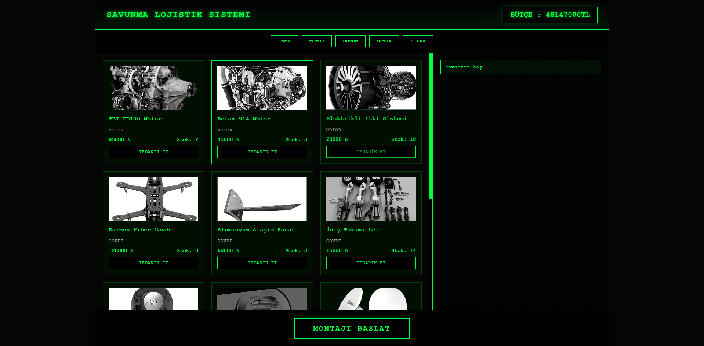

# 🛡️ Savunma Sanayii Lojistik ve Envanter Simülasyonu

Bu proje, **Vanilla JavaScript (ES6+)** kullanılarak geliştirilmiş, savunma sanayii temalı bir kaynak yönetimi ve üretim simülasyonudur. React veya Vue gibi herhangi bir framework kullanılmadan, tamamen saf JavaScript ile **DOM manipülasyonu**, **State yönetimi** ve **Veri kalıcılığı** yeteneklerini sergilemek amacıyla tasarlanmıştır.



## 🚀 Canlı Demo
Projenin çalışan halini incelemek için: **[(https://fatihbilgin1.github.io/defense-logistics-sim/)]**

## 🎯 Projenin Amacı
Kullanıcı, kısıtlı bir devlet ödeneği (bütçe) ile stratejik savunma parçalarını (Motor, Optik, Gövde, Mühimmat) tedarik etmeli ve bu parçaları envanterinde birleştirerek göreve hazır bir **İHA (İnsansız Hava Aracı)** montajı gerçekleştirmelidir.

## 🛠️ Kullanılan Teknolojiler

* **HTML5:** Semantik yapı.
* **CSS3:**
    * **CSS Grid & Flexbox:** Responsive yerleşim düzeni.
    * **CSS Variables:** Tema yönetimi ve renk paleti.
    * **Modern UI:** Glassmorphism, Neon Glow efektleri ve Askeri HUD tasarımı.
* **JavaScript (ES6+):**
    * `localStorage` API ile veri kalıcılığı.
    * `array.filter()`, `find()`, `some()` ve `forEach()` gibi yüksek seviye dizi metotları.
    * DOM Manipülasyonu ve Event Handling.

## ⚙️ Özellikler ve Algoritmalar

### 1. Dinamik Veri Yönetimi
Tüm ürün verileri JSON tabanlı bir obje yapısında tutulur ve JavaScript ile dinamik olarak DOM'a render edilir. Statik HTML kullanılmamıştır.

### 2. Filtreleme Sistemi (`.filter()`)
Kullanıcılar "Motor", "Gövde", "Optik" gibi kategorilere göre tedarik kataloğunu anlık olarak filtreleyebilir.

### 3. Satın Alma ve Stok Mantığı (Logic)
* **Bakiye Kontrolü:** Kullanıcının parası ürüne yetiyor mu?
* **Stok Kontrolü:** Tedarikçide yeterli stok var mı?
* **Envanter Yönetimi:** Ürün ilk kez mi alınıyor yoksa var olanın üzerine mi eklenmeli? (Upsert mantığı - `.find()` kullanılarak).

### 4. Montaj Kontrol Algoritması
"Montajı Başlat" fonksiyonu, envanter dizisini tarar ve bir İHA'nın uçuşa hazır olması için gerekli asgari şartları (En az 1 Motor, 1 Gövde, 1 Optik) `.some()` metodu ile kontrol eder. Eksik parça varsa kullanıcıyı uyarır.

### 5. Veri Kalıcılığı (LocalStorage)
Sayfa yenilendiğinde bakiye, stok durumu ve kişisel envanter kaybolmaz. Tarayıcı hafızasına anlık kayıt yapılır.

## 📂 Kurulum

Projeyi yerel makinenizde çalıştırmak için:

1.  Repoyu klonlayın:
    ```bash
    git clone [https://github.com/KULLANICI_ADIN/savunma-lojistik-simulasyonu.git](https://github.com/KULLANICI_ADIN/savunma-lojistik-simulasyonu.git)
    ```
2.  Klasöre gidin:
    ```bash
    cd savunma-lojistik-simulasyonu
    ```
3.  `index.html` dosyasını tarayıcınızda açın.

## 🔮 Gelecek Güncellemeler (To-Do)
- [ ] Mühimmat ve yakıt tüketim simülasyonu.
- [ ] Farklı İHA modelleri (SİHA, TİHA) için farklı montaj gereksinimleri.
- [ ] Drag & Drop (Sürükle Bırak) ile montaj arayüzü.

---
**Geliştirici:** Fatih Bilgin
**Lisans:** MIT
